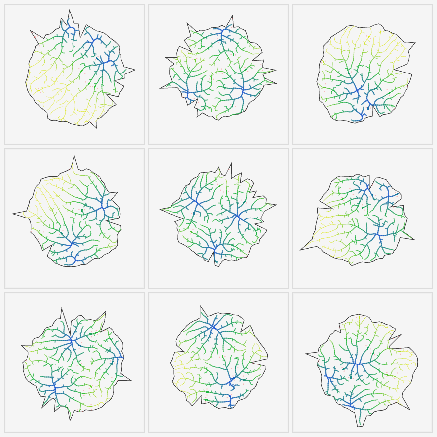

# Diffusion-Masterplanning 🧬

> "Bio-mimetic Urban Planning: Adapting Space Colonization Algorithm for irregular island boundaries."

### **Concept**
This project explores **Generative Masterplanning** by adapting the **Space Colonization Algorithm** (typically used for tree growth/veins) into an urban design tool.
Instead of manually drawing roads, the algorithm **automatically grows circulation networks** based on random island boundaries and attraction points.

### **Key Features**
* **Adaptive Logic:** The algorithm dynamically reacts to **randomly generated boundaries**, proving its versatility across different terrains (as shown in the 3x3 grid above).
* **Parallel Generation:** Capable of simulating multiple morphological scenarios simultaneously.
* **Web-based Prototype:** Originally developed in **Java/JavaScript (Processing)** for web accessibility, later informing Python-based architectural workflows.

### **Tech Stack**
* Java (Processing), JavaScript (p5.js)
